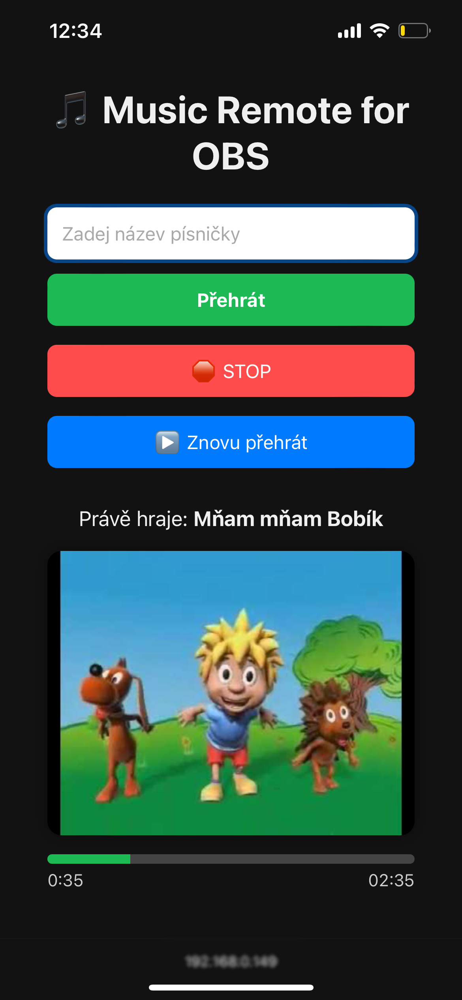

# 🎵 Music Remote for OBS


<li>Use in IRL streaming and more</li>
<li>Responsive UI for phone and computer</li>
<li>Only 1 python script file</li><br>
<div style="text-align: center; margin-top: 1rem;">

<p style="margin-top: 0.5rem; font-size: 1rem;">photo from mobile device</p></div><br>
<div style="text-align: center; margin-top: 1rem;">

<p style="margin-top: 0.5rem; font-size: 1rem; text-align: center;">photo from Mac</p></div><br>
<div style="text-align: center; margin-top: 1rem;">

<p style="margin-top: 0.5rem; font-size: 1rem; text-align: center;">photo from Windows 10</p></div>


## Installation

Use the package manager [pip](https://pip.pypa.io/en/stable/) to install flask, yt_dlp

```bash
pip install flask
```

```bash
pip install yt_dlp
```

Now download musicremote_obs.zip [DOWNLOAD HERE](https://github.com/mongomangoCZcz/Music-Remote-for-OBS/releases/tag/current)

## Run

```bash
python3 <path to the play_server.py file>
```

or

```bash
python <path to the play_server.py file>
```

This will be displayed if the music remote starts correctly.

